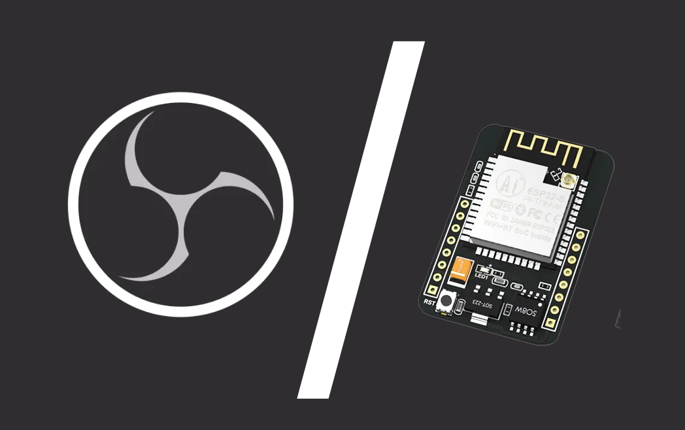

# OBS Recording LED Indicator (ESP32)


A physical recording status indicator for OBS Studio. When you start recording, an LED connected to an ESP32 blinks and stays ON. When you stop, it turns off. No more alt-tabbing to check if you're recording.

---

## How It Works

```
OBS hotkey pressed
       ↓
OBS WebSocket emits RecordStateChanged event
       ↓
Python script running on your PC receives the event
       ↓
Script sends an HTTP request to ESP32
       ↓
ESP32 blinks / lights the LED
```

Two protocols in play:
- **WebSocket** — between OBS and Python 
- **HTTP** — between Python and ESP32 

---

## Hardware Required

| Component | Quantity |
|---|---|
| ESP32 (any variant) | 1 |
| LED | 1 |
| 330Ω resistor | 1 |
| Breadboard + jumper wires | — |

**Wiring:**

```
ESP32 GPIO4  →  330Ω resistor  →  LED anode (+)
ESP32 GND    →  LED cathode (-)
```

> You can also use the onboard LED on GPIO2 with no extra wiring.

---

## Prerequisites

### OBS Studio
- Version 28 or later (WebSocket server is built in)

### Arduino IDE
Libraries needed (install via Library Manager):
- `WiFi.h` — built into ESP32 Arduino core
- `WebServer.h` — built into ESP32 Arduino core

### Python
- Python 3.x
- Packages:
```bash
pip install requests obsws-python
```

---

## Setup

### 1. Flash the ESP32

Open `esp32_led.ino` in Arduino IDE.

Edit these lines with your WiFi credentials:
```cpp
const char* ssid     = "YOUR_WIFI_SSID";
const char* password = "YOUR_WIFI_PASSWORD";
```

Flash to your ESP32. Open the Serial Monitor at **115200 baud** — note the IP address it prints:
```
Connected! IP: 192.168.1.45
```

### 2. Enable OBS WebSocket Server

In OBS: **Tools → WebSocket Server Settings**
- ✅ Enable WebSocket Server
- Port: `4455`
- Set a password
- Click **OK**

### 3. Configure the Python Script

Open `obs_led.py` and edit:
```python
ESP32_IP = "192.168.1.45"   # IP from Serial Monitor
OBS_PASS = "your_password"  # From OBS WebSocket settings
```

### 4. Run

Make sure OBS is open, then run:
```bash
python obs_led.py
```

You should see:
```
Listening for OBS recording events... (Ctrl+C to quit)
```

Press your OBS record hotkey — the LED will respond.

---

## LED Behavior

| Event | LED |
|---|---|
| Recording started | Blinks 3× fast, then stays ON |
| Recording stopped | Turns OFF, blinks 2× slow |

---

## Project Structure

```
obs-led-indicator/
├── esp32_led/
│   └── esp32_led.ino      # ESP32 Arduino sketch
├── obs_led.py             # Python listener script
└── README.md
```

---

## Troubleshooting

**`ConnectionRefusedError` when running the script**
→ OBS is not open, or WebSocket server is not enabled. Go to Tools → WebSocket Server Settings and confirm it's checked.

**`ESP32 unreachable` / connection timeout**
→ Check that your PC and ESP32 are on the same WiFi network. Reopen Serial Monitor to confirm the ESP32's current IP — it may have changed. Try visiting `http://<ESP32_IP>/record/on` in a browser to test directly.

**`ModuleNotFoundError`**
→ Install dependencies using the full Python path:
```bash
C:\Path\To\python.exe -m pip install requests obsws-python
```
